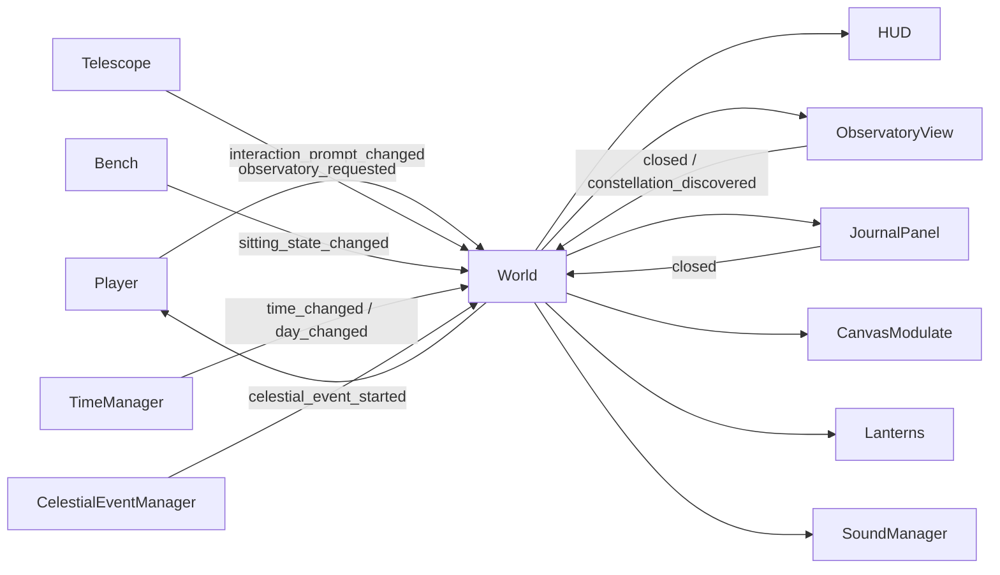

# Star Keeper — Tài liệu dự án

## 1. Tổng quan

`Star Keeper` là game pixel-art 2D góc nhìn từ trên xuống, được xây dựng bằng Godot 4.7. Người chơi điều khiển một người trông coi đài quan sát, đi lại trong khuôn viên, tương tác với kính thiên văn và mở màn hình quan sát bầu trời.

Phiên bản hiện tại là một vertical-slice prototype: người chơi khám phá khuôn viên, chờ đêm, quan sát và nối các vì sao thành 6 chòm sao, sau đó xem lại tiến độ trong sổ nhật ký.

| Thuộc tính | Giá trị hiện tại |
| --- | --- |
| Engine | Godot 4.7.1 |
| Ngôn ngữ | GDScript có static typing |
| Main scene | `res://scenes/world/world.tscn` |
| Viewport | 640 × 360 |
| Cửa sổ mặc định | 1280 × 720 |
| Kích thước bản đồ | 1280 × 720 |
| Renderer | Forward Plus |
| Trạng thái | Vertical slice có thể chơi, có artwork CC0 và smoke test end-to-end |

Repository: <https://github.com/HungPD0726/StarKeeper>

## 2. Trải nghiệm hiện tại

### Vòng lặp chơi

1. Người chơi xuất hiện trước nhà quan sát lúc 08:00.
2. Người chơi khám phá khu vực bằng `WASD`, có thể ngồi nghỉ trên ghế bằng `E` và xem Journal bằng `J`.
3. Kính thiên văn chỉ mở từ 19:00 đến trước 05:00; ban ngày HUD giải thích lý do chưa thể quan sát.
4. Trong Observatory View, nhấp hai ngôi sao để thử tạo một cạnh của chòm sao; nhấp phải để hủy lựa chọn.
5. Hoàn thành toàn bộ cạnh hợp lệ sẽ khám phá chòm sao, phát hiệu ứng và ghi kết quả vào Journal.
6. Nhấn `Escape` để trở về đúng vị trí trước đó.
7. Đồng hồ, ngày, ánh sáng và sự kiện thiên văn vẫn tiếp tục chạy ở phía sau.

### Điều khiển

| Hành động | Phím |
| --- | --- |
| Đi lên | `W` |
| Đi xuống | `S` |
| Đi trái | `A` |
| Đi phải | `D` |
| Tương tác | `E` |
| Mở/đóng Journal | `J` |
| Chọn và nối sao | Chuột trái |
| Hủy ngôi sao đang chọn | Chuột phải |
| Đóng Observatory View hoặc Journal | `Escape` |

Input dùng `physical_keycode`, vì vậy vị trí phím vẫn phù hợp trên các bố cục bàn phím khác nhau.

## 3. Tính năng đã hoàn thành

### Player

- `CharacterBody2D` di chuyển ở tốc độ mặc định 85 px/s.
- `Input.get_vector()` chuẩn hóa vector, không tăng tốc khi đi chéo.
- Tăng tốc 900 px/s² và giảm tốc 1200 px/s² giúp bắt đầu/dừng chuyển động tự nhiên hơn.
- Va chạm với biên bản đồ, hồ, nhà, ghế, cây, đá, cây khô và kính thiên văn.
- `Camera2D` không smoothing, giới hạn trong bản đồ 1280 × 720.
- `InteractionArea` phát hiện các `Interactable` gần người chơi.
- Nếu có nhiều vật thể trong vùng, vật thể gần nhất được chọn.
- Sprite nhân vật có idle pose và walk cycle 4 frame riêng cho bốn hướng.
- Nhịp bước bám theo quãng đường thực tế; sprite bob/sway đúng 1 pixel, bóng co lại khi nhấc chân và mỗi bước tạo một hạt bụi nhỏ.
- Signal `step_taken` kích hoạt âm thanh bước chân procedural tại World.
- Có thể khóa/mở điều khiển bằng `set_controls_enabled()`.
- Trạng thái ngồi khóa movement nhưng vẫn nhận `E` để đứng dậy; Player được đặt vào `SitMarker` của Bench.

### Interaction system

- `Interactable` là lớp cơ sở kế thừa `Area2D`.
- Mỗi vật thể có thể đặt `prompt_text` trong Inspector.
- Player chịu trách nhiệm phát hiện và gọi `interact(player)`.
- Telescope chỉ phát signal yêu cầu mở Observatory View; nó không tự quản lý scene.
- Bench phát signal đổi trạng thái ngồi; World đồng bộ trạng thái đó xuống Player.
- Prompt động được phát lại ngay sau mỗi lần tương tác.

### World

- World đóng vai trò coordinator giữa Player, interactable, TimeManager, CelestialEventManager, HUD, Journal và Observatory View.
- Không sử dụng autoload hoặc plugin.
- Nội dung có `y_sort_enabled` để sắp xếp đối tượng theo chiều dọc.
- Bản đồ kết hợp sprite pixel-art với `Polygon2D`: đường đá, quảng trường thiên văn, hồ ánh trăng, hàng rào và các mảng cỏ.
- Collision được tách khỏi visual, thuận tiện thay artwork mà không đổi gameplay.

### Ngày và đêm

- Chu kỳ 24 giờ mặc định kéo dài 150 giây.
- Bắt đầu lúc 08:00; khi qua 24:00, số ngày và HUD tăng lên.
- `Gradient` trong World điều khiển màu môi trường liên tục.
- `CanvasModulate` chỉ nhuộm thế giới; HUD nằm trong `CanvasLayer` nên giữ nguyên màu.
- Đèn lồng mờ dần lúc bình minh và sáng dần lúc hoàng hôn.
- Mỗi đêm, `CelestialEventManager` chọn đêm quang đãng hoặc mưa sao băng.

### HUD và Observatory View

- HUD hiển thị ngày, thời gian `HH:MM`, prompt tương tác, thông báo và gợi ý phím Journal.
- Observatory View là overlay trong cùng World, không thay SceneTree.
- Bầu trời có 24 ngôi sao tạo từ seed cố định `7319`.
- Vị trí sao không đổi giữa các lần mở; độ sáng nhấp nháy theo thời gian.
- Catalog hiện có 6 chòm sao với cạnh hợp lệ, tên, mô tả và manh mối thơ.
- Chuột được xử lý bằng `_gui_input()` của root `Control`, vì vậy GUI nhận click trước `_unhandled_input()`.
- Journal có `ScrollContainer`, hiển thị đủ 6 entry và tiến độ khám phá.
- Đóng view sẽ khôi phục HUD và điều khiển Player.

### Không khí, ánh sáng và âm thanh

- `WorldEnvironment` bật glow; các HDR color làm sao, đường nối và đom đóm phát sáng.
- `PointLight2D` dùng radial `GradientTexture2D`, có flicker và bóng từ `LightOccluder2D`.
- Wind shader làm tán cây, cỏ và hoa dao động; water shader tạo gợn sáng cho hồ.
- `ShootingStarSystem` tạo sao băng thường hoặc dày hơn trong sự kiện mưa sao băng.
- `SoundManager` tổng hợp chuông ngũ âm, phản hồi nối sao, notification và bước chân bằng `AudioStreamWAV`.

### Pixel-art rendering

- Texture filter mặc định là `nearest`.
- Stretch mode là `viewport`, aspect là `keep`.
- Scale mode là `integer`.
- Chỉ bật pixel snapping cho transform 2D.
- Camera không smoothing để tránh rung hoặc nhòe pixel.

## 4. Kiến trúc runtime



Nguyên tắc chính là “parent gọi xuống, child phát signal lên”. World là nơi duy nhất phối hợp trạng thái giữa các hệ thống, giúp Player và Telescope không phụ thuộc trực tiếp vào UI hoặc quản lý scene.

## 5. Giao diện nội bộ

| Thành phần | API | Ý nghĩa |
| --- | --- | --- |
| `Interactable` | `interact(player: Node2D) -> void` | Điểm mở rộng cho mọi vật thể tương tác |
| `Player` | `interaction_prompt_changed(text, visible)` | Yêu cầu cập nhật prompt trên HUD |
| `Player` | `step_taken(world_position)` | Báo một bước chân thực tế để kích hoạt VFX/SFX |
| `Player` | `set_controls_enabled(enabled)` | Khóa hoặc mở input di chuyển/tương tác |
| `Player` | `set_sitting(enabled, sit_position)` | Khóa movement và đặt Player vào vị trí ngồi |
| `Player` | `is_sitting() -> bool` | Trả về trạng thái ngồi hiện tại |
| `Telescope` | `observatory_requested` | Yêu cầu World mở màn quan sát |
| `Bench` | `sitting_state_changed(is_sitting)` | Yêu cầu World đổi trạng thái ngồi của Player |
| `Bench` | `get_sit_position() -> Vector2` | Cung cấp vị trí ngồi trong world space |
| `TimeManager` | `time_changed(time_text, environment_color)` | Cung cấp giờ đã format và màu môi trường |
| `TimeManager` | `day_changed(day_number, day_text)` | Báo khi đồng hồ bước sang ngày mới |
| `TimeManager` | `get_time_text() -> String` | Trả về giờ theo định dạng `HH:MM` |
| `TimeManager` | `get_environment_color() -> Color` | Lấy màu hiện tại từ Gradient |
| `HUD` | `set_time_text(text)` | Cập nhật đồng hồ |
| `HUD` | `set_interaction_prompt(text, is_visible)` | Cập nhật prompt tương tác |
| `HUD` | `show_notification(text, duration)` | Hiển thị thông báo tạm thời |
| `ObservatoryView` | `open_view()` / `close_view()` | Điều khiển vòng đời overlay |
| `ObservatoryView` | `closed` | Báo cho World khôi phục gameplay |
| `ObservatoryView` | `constellation_discovered(data)` | Báo một chòm sao vừa hoàn thành |
| `JournalPanel` | `setup(catalog)` / `open_journal()` / `close_journal()` | Hiển thị catalog và tiến độ |

## 6. Collision layers

| Layer | Tên | Được dùng bởi |
| --- | --- | --- |
| 1 | `world` | Biên bản đồ, hồ, nhà, ghế, cây, đá và vật cản |
| 2 | `player` | `CharacterBody2D` của Player |
| 3 | `interactable` | Telescope, Bench và các `Interactable` tương lai |

Player va chạm layer `world`; `InteractionArea` chỉ dò layer `interactable`.

## 7. Artwork và giấy phép

Artwork môi trường đến từ **Cozy Asset Pack 1.0** của Ishtar Pixels. Nhân vật dùng **Top Down Player Sprite Sheet (Julia)** của ArlanTR với walk cycle bốn hướng. Cả hai bộ đều phát hành theo giấy phép CC0.

- Chi tiết attribution: [`CREDITS.md`](CREDITS.md)
- License môi trường: [`assets/third_party/cozy_asset_pack/LICENSE.txt`](assets/third_party/cozy_asset_pack/LICENSE.txt)
- License nhân vật: [`assets/third_party/julia_character/LICENSE.txt`](assets/third_party/julia_character/LICENSE.txt)
- Sources: <https://opengameart.org/content/cozy-asset-pack-10> và <https://opengameart.org/content/top-down-player-sprite-sheet-julia>

Asset CC0 có thể được lưu trực tiếp trong repository công khai. Khi thêm asset pack khác, phải kiểm tra riêng điều khoản redistribution trước khi commit file gốc.

## 8. Chạy và kiểm thử

### Chạy trong editor

Mở `project.godot` bằng Godot 4.7.x. Nhấn `F5` để chạy project hoặc `F6` để chạy scene đang mở.

### Chạy từ command line

```powershell
godot --path .
```

### Import và kiểm tra project

```powershell
godot --headless --editor --path . --quit
godot --headless --path . --quit-after 120
```

### Smoke test

```powershell
godot --headless --path . --script res://tests/mvp_smoke_test.gd
```

### Export Windows

Preset `Windows Desktop` trong `export_presets.cfg` tạo release x86_64 và nhúng PCK vào một file EXE:

```powershell
godot --headless --import --path .
godot --headless --path . --export-release "Windows Desktop" build/windows/StarKeeper.exe
```

Artifact nằm tại `build/windows/StarKeeper.exe`; toàn bộ `build/` bị loại khỏi Git.

Smoke test hiện kiểm tra:

- Project settings dành cho pixel art.
- Input dùng đúng physical keycode.
- Player, Camera, HUD, Telescope và Observatory View tồn tại.
- Player có đủ idle/walk animation cho bốn hướng; mỗi walk cycle có 4 frame.
- Movement phát step event, giảm tốc về 0 và visual trở lại vị trí nghỉ.
- Biên bản đồ chặn Player.
- Màu ngày/đêm thay đổi.
- Prompt xuất hiện đúng khi đến gần Telescope.
- Telescope bị chặn ban ngày và mở đúng vào ban đêm.
- Click chuột đi qua luồng GUI thật, nối đủ cạnh và khám phá The Beacon.
- `E` mở view, khóa Player và ẩn HUD.
- `Escape` đóng view, khôi phục vị trí và điều khiển.
- Bầu trời luôn tạo đúng 24 ngôi sao.
- Catalog có 6 chòm sao; Journal sinh đủ 6 entry trong vùng cuộn và cập nhật tiến độ.
- Bench cập nhật prompt, đặt Player vào SitMarker, khóa movement và cho phép đứng dậy.
- Ngày tăng đúng khi qua 24:00; glow, lantern, particle, pond collision và graphics nodes tồn tại.
- Scene được giải phóng trước khi test thoát, không còn cảnh báo `ObjectDB` leak.

## 9. Giới hạn hiện tại

- Idle theo hướng hiện chỉ có một frame; trạng thái ngồi chưa có sprite animation riêng.
- Telescope vẫn là visual `Polygon2D` tạm thời.
- Có 6 chòm sao cố định trên một star field; chưa có sky map hoặc catalog mở rộng theo mùa.
- Ngày tăng liên tục nhưng chưa có lịch, quest hoặc thay đổi nội dung theo ngày.
- Chưa có save/load, menu, hội thoại, inventory hoặc tutorial tương tác.
- Âm thanh hiện là hiệu ứng procedural; chưa có nhạc nền, ambience hoặc audio settings.
- Bản đồ chưa dùng `TileMapLayer` và chưa có quy trình dựng level từ tileset.

## 10. Hướng phát triển đề xuất

Ưu tiên cho vertical slice tiếp theo:

1. Thêm animation idle nhiều frame, ngồi ghế và sử dụng kính thiên văn cho Player.
2. Thêm save/load cho ngày hiện tại và trạng thái khám phá chòm sao.
3. Bổ sung tutorial nối sao, phản hồi hover/keyboard và tùy chọn accessibility.
4. Thay visual `Polygon2D` của Telescope/Bench bằng artwork đồng bộ với environment pack.
5. Thêm ambience ban ngày/ban đêm, nhạc nền và điều chỉnh volume.
6. Khi map mở rộng, chuyển nền sang `TileMapLayer` nhưng tiếp tục tách collision gameplay khỏi visual.
