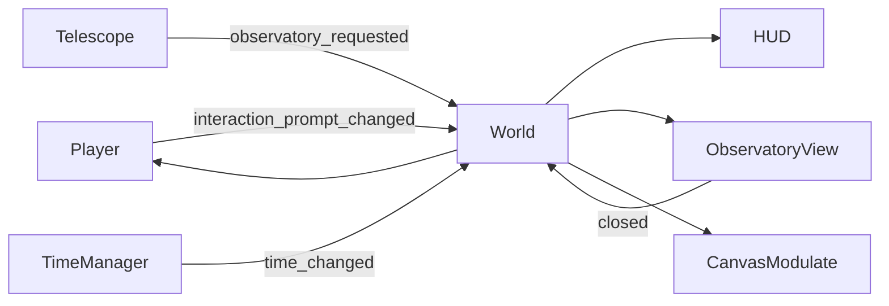

# Star Keeper — Tài liệu dự án

## 1. Tổng quan

`Star Keeper` là game pixel-art 2D góc nhìn từ trên xuống, được xây dựng bằng Godot 4.7. Người chơi điều khiển một người trông coi đài quan sát, đi lại trong khuôn viên, tương tác với kính thiên văn và mở màn hình quan sát bầu trời.

Phiên bản hiện tại là một MVP kỹ thuật: vòng lặp di chuyển → tìm vật thể tương tác → dùng kính thiên văn → quan sát trời → quay lại thế giới đã hoạt động đầy đủ.

| Thuộc tính | Giá trị hiện tại |
| --- | --- |
| Engine | Godot 4.7.1 |
| Ngôn ngữ | GDScript có static typing |
| Main scene | `res://scenes/world/world.tscn` |
| Viewport | 640 × 360 |
| Cửa sổ mặc định | 1280 × 720 |
| Kích thước bản đồ | 1280 × 720 |
| Renderer | Forward Plus |
| Trạng thái | MVP có thể chơi và có smoke test |

Repository: <https://github.com/HungPD0726/StarKeeper>

## 2. Trải nghiệm hiện tại

### Vòng lặp chơi

1. Người chơi xuất hiện trước nhà quan sát lúc 08:00.
2. Người chơi khám phá khu vực bằng `WASD`.
3. Khi đến gần kính thiên văn, HUD hiển thị lời nhắc tương tác.
4. Nhấn `E` để mở Observatory View.
5. Điều khiển nhân vật và HUD được khóa trong lúc quan sát.
6. Nhấn `Escape` để trở về đúng vị trí trước đó.
7. Đồng hồ và chu kỳ ánh sáng vẫn tiếp tục chạy ở phía sau.

### Điều khiển

| Hành động | Phím |
| --- | --- |
| Đi lên | `W` |
| Đi xuống | `S` |
| Đi trái | `A` |
| Đi phải | `D` |
| Tương tác | `E` |
| Đóng Observatory View | `Escape` |

Input dùng `physical_keycode`, vì vậy vị trí phím vẫn phù hợp trên các bố cục bàn phím khác nhau.

## 3. Tính năng đã hoàn thành

### Player

- `CharacterBody2D` di chuyển ở tốc độ mặc định 85 px/s.
- `Input.get_vector()` chuẩn hóa vector, không tăng tốc khi đi chéo.
- Tăng tốc 900 px/s² và giảm tốc 1200 px/s² giúp bắt đầu/dừng chuyển động tự nhiên hơn.
- Va chạm với biên bản đồ, nhà, cây, đá, cây khô và kính thiên văn.
- `Camera2D` không smoothing, giới hạn trong bản đồ 1280 × 720.
- `InteractionArea` phát hiện các `Interactable` gần người chơi.
- Nếu có nhiều vật thể trong vùng, vật thể gần nhất được chọn.
- Sprite nhân vật có idle pose và walk cycle 4 frame riêng cho bốn hướng.
- Nhịp bước bám theo quãng đường thực tế; sprite bob/sway đúng 1 pixel, bóng co lại khi nhấc chân và mỗi bước tạo một hạt bụi nhỏ.
- Signal `step_taken` sẵn sàng để gắn âm thanh bước chân ở giai đoạn sau.
- Có thể khóa/mở điều khiển bằng `set_controls_enabled()`.

### Interaction system

- `Interactable` là lớp cơ sở kế thừa `Area2D`.
- Mỗi vật thể có thể đặt `prompt_text` trong Inspector.
- Player chịu trách nhiệm phát hiện và gọi `interact(player)`.
- Telescope chỉ phát signal yêu cầu mở Observatory View; nó không tự quản lý scene.

### World

- World đóng vai trò coordinator giữa Player, Telescope, TimeManager, HUD và Observatory View.
- Không sử dụng autoload hoặc plugin.
- Nội dung có `y_sort_enabled` để sắp xếp đối tượng theo chiều dọc.
- Hình nền vẫn dùng `Polygon2D`; các vật thể chính đã dùng sprite pixel-art.
- Collision được tách khỏi visual, thuận tiện thay artwork mà không đổi gameplay.

### Ngày và đêm

- Chu kỳ 24 giờ mặc định kéo dài 150 giây.
- Bắt đầu lúc 08:00 và lặp trong `Day 1`.
- `Gradient` trong World điều khiển màu môi trường liên tục.
- `CanvasModulate` chỉ nhuộm thế giới; HUD nằm trong `CanvasLayer` nên giữ nguyên màu.

### HUD và Observatory View

- HUD hiển thị `Day 1`, thời gian `HH:MM` và prompt tương tác.
- Observatory View là overlay trong cùng World, không thay SceneTree.
- Bầu trời có 24 ngôi sao tạo từ seed cố định `7319`.
- Vị trí sao không đổi giữa các lần mở; độ sáng nhấp nháy theo thời gian.
- Đóng view sẽ khôi phục HUD và điều khiển Player.

### Pixel-art rendering

- Texture filter mặc định là `nearest`.
- Stretch mode là `viewport`, aspect là `keep`.
- Scale mode là `integer`.
- Chỉ bật pixel snapping cho transform 2D.
- Camera không smoothing để tránh rung hoặc nhòe pixel.

## 4. Kiến trúc runtime



Nguyên tắc chính là “parent gọi xuống, child phát signal lên”. World là nơi duy nhất phối hợp trạng thái giữa các hệ thống, giúp Player và Telescope không phụ thuộc trực tiếp vào UI hoặc quản lý scene.

## 5. Giao diện nội bộ

| Thành phần | API | Ý nghĩa |
| --- | --- | --- |
| `Interactable` | `interact(player: Node2D) -> void` | Điểm mở rộng cho mọi vật thể tương tác |
| `Player` | `interaction_prompt_changed(text, visible)` | Yêu cầu cập nhật prompt trên HUD |
| `Player` | `step_taken(world_position)` | Báo một bước chân thực tế để kích hoạt VFX/SFX |
| `Player` | `set_controls_enabled(enabled)` | Khóa hoặc mở input di chuyển/tương tác |
| `Telescope` | `observatory_requested` | Yêu cầu World mở màn quan sát |
| `TimeManager` | `time_changed(time_text, environment_color)` | Cung cấp giờ đã format và màu môi trường |
| `TimeManager` | `get_time_text() -> String` | Trả về giờ theo định dạng `HH:MM` |
| `TimeManager` | `get_environment_color() -> Color` | Lấy màu hiện tại từ Gradient |
| `HUD` | `set_time_text(text)` | Cập nhật đồng hồ |
| `HUD` | `set_interaction_prompt(text, is_visible)` | Cập nhật prompt tương tác |
| `ObservatoryView` | `open_view()` / `close_view()` | Điều khiển vòng đời overlay |
| `ObservatoryView` | `closed` | Báo cho World khôi phục gameplay |

## 6. Collision layers

| Layer | Tên | Được dùng bởi |
| --- | --- | --- |
| 1 | `world` | Biên bản đồ, nhà, cây, đá, vật cản |
| 2 | `player` | `CharacterBody2D` của Player |
| 3 | `interactable` | Telescope và các `Interactable` tương lai |

Player va chạm layer `world`; `InteractionArea` chỉ dò layer `interactable`.

## 7. Artwork và giấy phép

Artwork môi trường đến từ **Cozy Asset Pack 1.0** của Ishtar Pixels. Nhân vật dùng **Top Down Player Sprite Sheet (Julia)** của ArlanTR với walk cycle bốn hướng. Cả hai bộ đều phát hành theo giấy phép CC0.

- Chi tiết attribution: [`CREDITS.md`](CREDITS.md)
- License môi trường: [`assets/third_party/cozy_asset_pack/LICENSE.txt`](assets/third_party/cozy_asset_pack/LICENSE.txt)
- License nhân vật: [`assets/third_party/julia_character/LICENSE.txt`](assets/third_party/julia_character/LICENSE.txt)
- Sources: <https://opengameart.org/content/cozy-asset-pack-10> và <https://opengameart.org/content/top-down-player-sprite-sheet-julia>

Asset CC0 có thể được lưu trực tiếp trong repository công khai. Khi thêm asset pack khác, phải kiểm tra riêng điều khoản redistribution trước khi commit file gốc.

## 8. Chạy và kiểm thử

### Chạy trong editor

Mở `project.godot` bằng Godot 4.7.x. Nhấn `F5` để chạy project hoặc `F6` để chạy scene đang mở.

### Chạy từ command line

```powershell
godot --path .
```

### Import và kiểm tra project

```powershell
godot --headless --editor --path . --quit
godot --headless --path . --quit-after 120
```

### Smoke test

```powershell
godot --headless --path . --script res://tests/mvp_smoke_test.gd
```

Smoke test hiện kiểm tra:

- Project settings dành cho pixel art.
- Input dùng đúng physical keycode.
- Player, Camera, HUD, Telescope và Observatory View tồn tại.
- Player có đủ idle/walk animation cho bốn hướng; mỗi walk cycle có 4 frame.
- Movement phát step event, giảm tốc về 0 và visual trở lại vị trí nghỉ.
- Biên bản đồ chặn Player.
- Màu ngày/đêm thay đổi.
- Prompt xuất hiện đúng khi đến gần Telescope.
- `E` mở view, khóa Player và ẩn HUD.
- `Escape` đóng view, khôi phục vị trí và điều khiển.
- Bầu trời luôn tạo đúng 24 ngôi sao.

## 9. Giới hạn của MVP

- Idle theo hướng hiện chỉ có một frame; chưa có animation tương tác hoặc sử dụng công cụ.
- Telescope vẫn là visual `Polygon2D` tạm thời.
- Chưa có gameplay nhận dạng hoặc thu thập chòm sao.
- Chưa giới hạn Telescope theo giờ ban đêm.
- Chu kỳ luôn lặp trong `Day 1`; chưa có nhiều ngày.
- Chưa có save/load, menu, âm thanh, hội thoại hoặc inventory.
- Bản đồ chưa dùng `TileMapLayer` và chưa có quy trình dựng level từ tileset.

## 10. Hướng phát triển đề xuất

Ưu tiên cho vertical slice tiếp theo:

1. Thêm idle animation nhiều frame và animation tương tác cho Player.
2. Tạo gameplay tìm và ghi nhận 3 chòm sao trong Observatory View.
3. Chỉ cho phép quan sát trong một khung giờ ban đêm và hiển thị lý do khi chưa đủ điều kiện.
4. Thêm nhật ký khám phá đơn giản vào HUD.
5. Bổ sung âm thanh môi trường, hiệu ứng tương tác và một màn hình mở đầu nhỏ.
6. Khi map bắt đầu mở rộng, chuyển phần nền sang `TileMapLayer` và giữ collision gameplay tách biệt.
